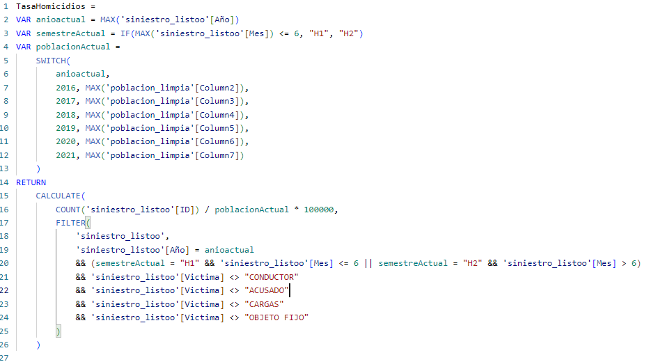
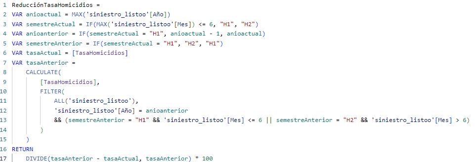
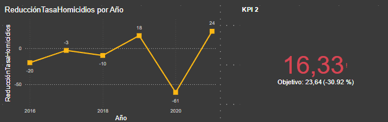
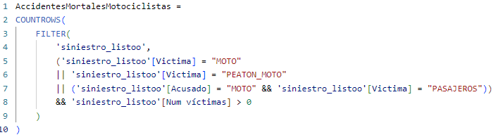
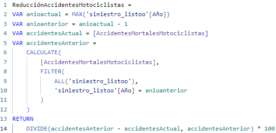

## En este archivo explico los codigos utilizados para desarrollar los KPIS en Power Bi

**KPI 1: Reducir en un 10% la tasa de homicidios en siniestros viales en los últimos seis meses en comparación con el semestre anterior**

Tasa de homicidios en siniestros viales : Número de víctimas fatales en accidentes de tránsito por cada 100,000 habitantes. Fórmula: (Número de homicidios en siniestros viales / Población total) * 100,000

Primero cree **TasaHomicidios:**

Luego cree **ReduccionTasaHomicidios:**

**Asi se ve en PowerBi:**

---

**KPI 2: Reducir en un 7% la cantidad de accidentes mortales de motociclistas en el último año respecto al año anterior** .

* **Cantidad de accidentes mortales de motociclistas** : Número absoluto de accidentes fatales con víctimas en moto. Fórmula: (Accidentes mortales de motociclistas del año anterior - Accidentes mortales de motociclistas del año actual) / Accidentes mortales de motociclistas del año anterior * 100

Primero cree **AccidentesMortalesMotociclistas:**

Luego cree **ReducciónAccidentesMortalesMotociclistas**

**Asi se ve en PowerBi:**

