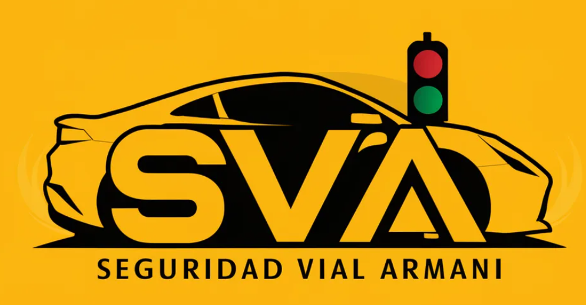
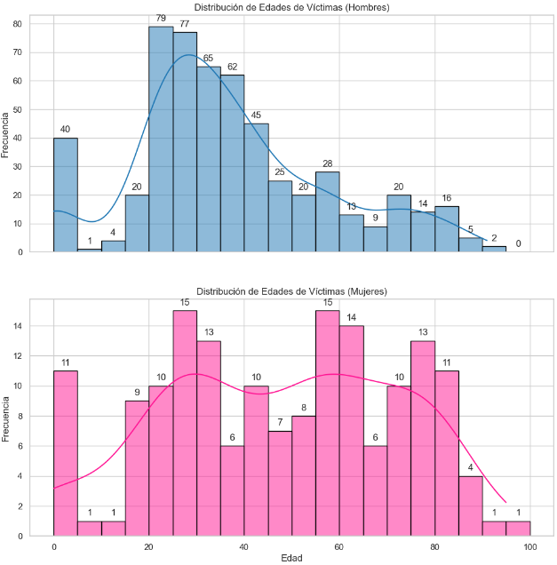
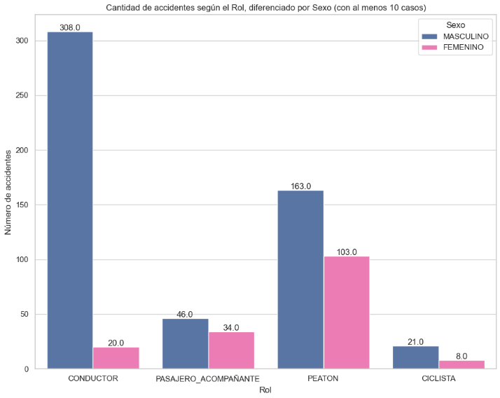
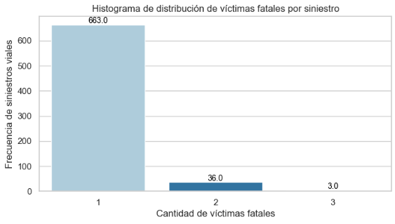
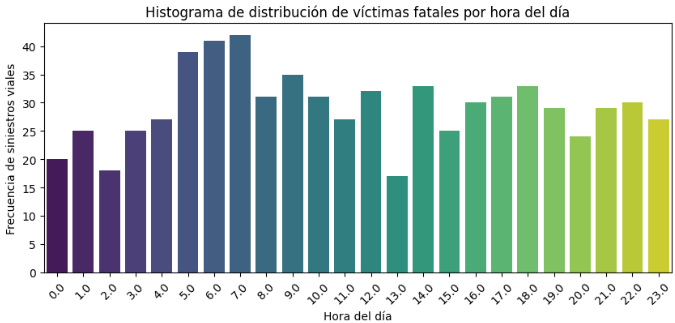
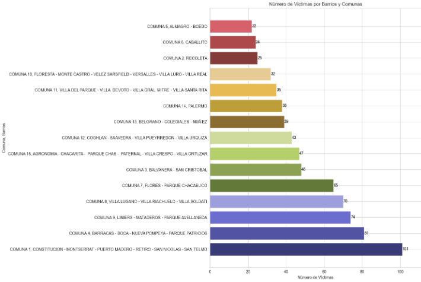
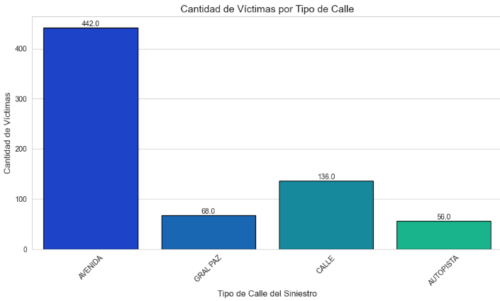

# Proyecto individual N2 - Siniestros Viales

---

### Seguridad Vial Armani - SVA

🚗 Los sucesos viales, también conocidos como accidentes de tráfico, ocurren en las vías públicas e incluyen desde colisiones de vehículos hasta atropellos, choques contra objetos fijos y vuelcos de automóviles. Estos eventos pueden causar daños materiales, lesiones graves o, tristemente, la pérdida de vidas humanas.

🏙️ En una ciudad grande como Buenos Aires, la preocupación por estos incidentes es significativa debido al tráfico denso y la alta densidad poblacional. Esto afecta la seguridad de los residentes y visitantes, así como la infraestructura vial y los servicios de emergencia.

📊 Las estadísticas de mortalidad relacionadas con estos accidentes son indicadores críticos de la seguridad vial. Se evalúan en función del número de fallecimientos en relación con la población o el número de vehículos. Reducir estas cifras es fundamental para mejorar la seguridad y salvar vidas.

En Argentina, alrededor de 4,000 personas pierden la vida anualmente en estos sucesos, siendo la principal causa de muertes violentas. Entre 2018 y 2022, se registraron 19,630 fallecimientos según el Sistema Nacional de Información Criminal, lo que equivale a un promedio de 11 muertes diarias. En 2022, se registraron 3,828 decesos.

🔍 Abordar estos problemas y reducir las tasas de mortalidad es esencial para mejorar la seguridad vial en Buenos Aires y en todo el país.

---

### Descripción del Proyecto

📊 **Propósito:**

* El objetivo principal de este proyecto es realizar un análisis exhaustivo de los datos relacionados con homicidios en accidentes viales ocurridos en la Ciudad de Buenos Aires durante el período de 2016 a 2021.

🎯 **Objetivo:**

* Generar información relevante y detallada que pueda ser utilizada por las autoridades locales. Esta información tiene el propósito de ayudar en la implementación de medidas efectivas que reduzcan la cantidad de víctimas mortales en accidentes de tránsito.

🚦 **Contexto:**

* **Área de Estudio:** Ciudad de Buenos Aires
* **Período de Análisis:** 2016 - 2021
* **Enfoque:** Homicidios en accidentes viales

---

### Metodología y Herramientas

Para llevar a cabo este proyecto, se siguieron los siguientes procesos:

### 🛠️Empezamos por el proceso **ETL (📦 Extract, 🔄 Transform, 📤 Load)**

- 🔍 **Recopilación de Datos:**

  - Se obtuvo un conjunto de datos suministrado por la Secretaría de Transporte del Gobierno de la Ciudad Autónoma de Buenos Aires, el cual detallaba información sobre homicidios en accidentes de tránsito.
- **📦 Extraccio**n de datos:

  - La fuente de datos para este proyecto fueron 2 archivos xslx.
  - Podes ver el diccionario de datos de Siniestros Viales tocando **[ACA](https://github.com/bautiarmanicode/SiniestrosViales-BSAS/blob/main/0%20Dataset/Diccionario%20de%20datos%20Siniestros%20viales.xlsx%20-%20DICCIONARIO_HECHOS.csv).**
- 🔄 **Transformaciones de los datos:**

  - Preparamos los datos para correcta lectura:
  - Eliminadas columnas irrelevantes.
  - Eliminados datos faltantes o nulos.
  - Eliminados registros o filas repetidas.
  - Transformaciones en los tipos de datos.
- **📤 Carga de datos limpios**

  - Exportamos los datos como un archivo CSV.
- Podes observar el proceso ETL haciendo click **[ACA](https://github.com/bautiarmanicode/SiniestrosViales-BSAS/blob/main/1%20Jupiter%20Notebook/1_ETL-Limpieza.ipynb).**

#### 🔎EDA (Análisis Exploratorio de Datos)

✅ Una vez que toda la data esta limpia gracias al Data Engineer que hizo **🛠️ETL** , hacer 🔎 **EDA** nos permite entender bien los datos a los que tenemos acceso.

Puedes leer un poco más sobre EDA en [este articulo](https://medium.com/swlh/introduction-to-exploratory-data-analysis-eda-d83424e47151).

El codigo usado en esta parte del proceso se encuentra **[ACA](https://github.com/bautiarmanicode/SiniestrosViales-BSAS/blob/main/1%20Jupiter%20Notebook/2_EDA.ipynb).**

* **Visualización Inicial:** Se crearon gráficos para comprender la distribución y las tendencias de los datos.
* **Identificación de Patrones:** Se analizaron variables influyentes como tiempo, ubicación y circunstancias de los accidentes.

---

### 🔧 **Herramientas y Tecnologías:**

* **Lenguajes de Programación:** Python
* **Herramientas de Análisis:** Pandas, NumPy
* **Visualización:** Matplotlib, Seaborn, Power Bi
* **Fuentes de Datos:** Secretaría de Transporte del Gobierno de la Ciudad Autónoma de Buenos Aires

---

### Estructura de navegación de los archivos:

* **📂 /0 Dataset/**: Contiene las bases de datos utilizadas para este proyecto
* **📂/1 Jupyter Notebook/:** Contiene el **ETL, EDA y data_utils.py** un archivo creado para importar funciones utiles, y **KPIS.MD** un archivo explicando como desarrolle los KPIS.
* **📂/image/README**: esta carpeta contiene las imagenes utilizadas en el proyecto
* **📂/3 Power Bi Dashboard/:** contiene la presentacion para Power Bi.

---

### 📈 Descubrimientos EDA

El análisis exploratorio de datos permitió extraer información valiosa sobre tendencias y patrones de homicidios en accidentes de tránsito, fundamentales para desarrollar recomendaciones y políticas que mejoren la seguridad vial.

🚀 **Conclusión:**

Este proyecto busca no solo analizar datos históricos, sino también proporcionar una base sólida para acciones futuras que mejoren la seguridad vial en la Ciudad de Buenos Aires, salvando vidas y mejorando la calidad de vida de sus habitantes.

Voy a compartir los descubrimientos mas relevantes que encontre:

- Mientras más joven es el hombre es mas propenso a accidentes.
- Mientras que en las mujeres esto es mucho mas uniforme.

- En general los hombres son los mas accidentados, siendo los conductores y los peatones los principales afectados.
- En el caso de las mujeres, las mas afectadas son las peaton, seguidos de los pasajero_acompañante.

Por lo general, las victimas son individuales.

Los horarios mas peligrosos son entre las 5 y las 7 de la mañana.

La comuna mas peligrosa es la Comuna 1, compuesta por los barrios:

* PUERTO MADERO
* RETIRO
* SAN NICOLAS
* SAN TELMO

La mayoria de los siniestros ocurren en Avenidas.

---

### KPI (Indicador Clave de Desempeño)

* Un KPI (Key Performance Indicator) es una métrica que mide el rendimiento de un proceso o actividad en relación con un objetivo estratégico predefinido. A diferencia de una métrica convencional, un KPI está diseñado para mostrar el progreso hacia un objetivo específico y, por lo tanto, suele incluir un valor objetivo o umbral.
* **KPI 1: Reducir en un 10% la tasa de homicidios en siniestros viales en los últimos seis meses en comparación con el semestre anterior**

  * **Tasa de homicidios en siniestros viales** : Número de víctimas fatales en accidentes de tránsito por cada 100,000 habitantes.
  * Fórmula: (Número de homicidios en siniestros viales / Población total) * 100,000
* **KPI 2: Reducir en un 7% la cantidad de accidentes mortales de motociclistas en el último año respecto al año anterior** .

  * **Cantidad de accidentes mortales de motociclistas** : Número absoluto de accidentes fatales con víctimas en moto.
  * Fórmula: (Accidentes mortales de motociclistas del año anterior - Accidentes mortales de motociclistas del año actual) / Accidentes mortales de motociclistas del año anterior * 100

---

### Recomendaciones para mejorar la situacion

En el análisis podemos observar diferentes caracteristicas de las victimas y patrones temporales

- ortalecer la educación vial:
  - Implementar programas de educacion vial obligatorios y continuos en escuelas y centros de formación de conductores.
  - Realizar campañas de concientizacion masivas sobre seguridad vial, enfocadas en conductas de riesgo (exceso de velocidad, conduccion bajo efectos de alcohol o drogas y distracción al volante)
- Mejorar la infraestructura vial:
  - Realizar una evaluacion exhaustiva de las vías más propensas a accidentes y mejorar la señalizacion, iluminación y diseño de las mismas.
  - Construir más carriles exclusivos para motocicletas y cruces peatonales seguros.
  - Implementar tecnologías de tráfico inteligente, com sistema de monitoreo y control de semáforos adaptativos.
- Reforzar los controles y sanciones:
  - Incrementar los controles de tránsito en las áreas críticas identificadas y durante los horarios pico.
  - Aplicar sanciones más estrictas y efectivas para infracciones graves.
- Proteger a los usuarios vulnerables:
  - Implementar medidas para motociclistas, como campañas de uso obligatorio de cascos, chalecos reflectantes y capacitación de conducción defensiva.
  - Promover el uso de elementos de seguridad pasiva, como airbags, sistemas de frenado avanzado
- Fomentar altenativas sostenibles de transporte:Explorar alternativas de movilidad compartida y autónoma, que puedan reducir el tráfico y los riesgos asociados.
- Recopilar y analizar datos de manera continua:
  - Establecer un sistema robusto de recopilación y análisis de datos relacionados con siniestros viales, incluyendo factores como ubicación, hora, tipo de vehículom causas y consecuencias.
  - Relizar análisis predictivos y estudios de alto impacto para evaluar la efectividad de las medidas implementadas y ajustar las estrategias según sea necesario.

Estas recomendaciones abordan diferentes aspectos del problema.
Su implementación coordinada y efectiva puede contribuir significativamente a reducir la cantidad de víctimas fatales en siniestros viales y mejorar la seguridad vial en la Ciudad de Buenos Aires.
